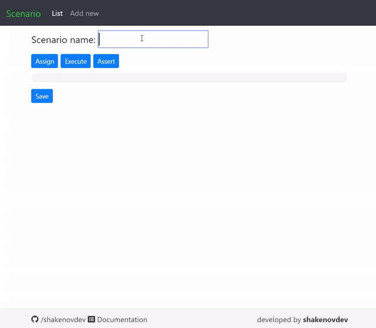
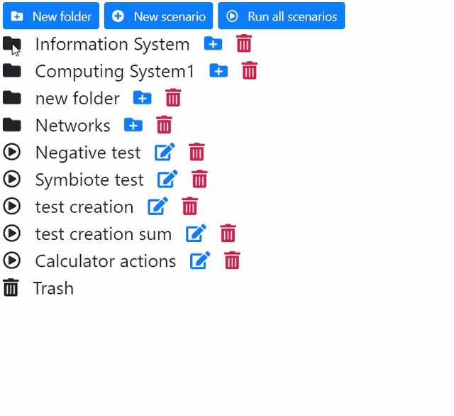

# Automated test library for ASP.NET projects #

### Prototype of idea to write/execute tests of code classes from browser. The solution based on [`System.Reflection`](https://docs.microsoft.com/en-us/dotnet/framework/reflection-and-codedom/reflection) to collect the testing data of target assembly.

### Supported members:
* Properties
* Constructors
* Fields
* Methods

## Getting Started

## Test creation

The test creation consists of three actions:
1. Assign – create a named variable
2. Execute – create a new object instance or invoke method
3. Assert – compare an actual result and expected one

***

## Test execution

